# Trailers Demand Planner
(Developer: Kamil Wojciechowski)

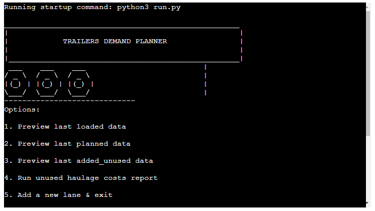

[Live webpage](https://trailers-demand-planner.herokuapp.com/)

## About 

Trailers Demand Planner - program inspired by work experience of a freight forwarder.

Calculates a forecast how many trailers are to be ordered from a haulier by a freight forwarder based on previous data.
Additionally other options allow the user to preview the data, run unused haulage costs report with possibility of adding/deleting lanes. 

Its objective is to support everyday tasks of a freight forwarder.

## Table of Contents

1. [Project Goals](#project-goals)
    - [User Goals](#user-goals)
    - [Business Owner Goals](#business-owner-goals)
2. [User Experience](#user-experience)
    - [Target Audience](#target-audience)
    - [User Requirements and Expectations](#user-requirements-and-expectations)
    - [User Manual](#user-manual)
    - [User Stories](#user-stories)
3. [Technical Design](#technical-design)
4. [Languages](#languages)
5. [Technologies Used](#technologies-used)
6. [Libraries](#libraries)
7. [Features](#features)
8. [Validation](#validation)
    - [HTML Validation](#HTML-validation)
    - [CSS Validation](#CSS-validation)
    - [JavaScript Validation](#javascript-validation)
    - [Accessibility](#accessibility)
    - [Performance](#performance)
    - [Device testing](#device-testing)
    - [Browser compatibility](#browser-compatibility)
    - [Testing user stories](#testing-user-stories)
 9. [Bugs](#Bugs)
 10. [Deployment](#deployment)
 11. [Credits](#credits)
 12. [Acknowledgements](#acknowledgements)

## Project Goals

### User Goals
- Find how many trailers were loaded last time.
- Check how many trailers should be ordered for next loading operations.
- Check how many trailers were left unused or ordered without advance.
- Identify costs generated by unused trailers.
- Add or delete lane.
- Delete previously entered data.
- Automate daily tasks of forecasting trailers demand.

### Business Owner Goals
- Access data related to daily operations.
- Identify unecessary operations costs.
- Provide employees with a simple tool to manage their daily tasks. 
- Improve productivity by automatic day-to-day tasks.

[Back to Table Of Contents](#table-of-contents)

## User Experience

### Target Audience
- Freight forwarders, planners, road logistics operators or other similar specialists working in the transport, supply chain & logistics field. 
- Companies involved in the relevant operations specific to the transport, supply chain & logistics field.

### User Requirements and Expectations
- A simple, easy to train on tool to manage daily tasks at work.
- Easy access to information crucial to perform the operations.
- Easy navigation.
- Possiblity to confirm intention to delete.

### User Manual

Click for instructions

#### Main Menu
Opens with the program Consists of three main parts:
- Logo
- Options
- User input

Actions:
- Review and select one of the options by inputing the index number of the option confirming with enter.
- If an invalid option is selected the program will print: "Invalid Option, please try again" & "Press enter to return to the menu": 
    In this case user needs to press enter to see the main menu again and choose one of the options: 1 - 9 or 0

#### Option 1: Preview last loaded data
After choosing option 1 the program will print how many trailers were loaded for their corresponding lane,
Example 'Cork, IE->Dublin, IE': '0', which should be interpreted as 0 trailers were loaded during last operations on the Cork, IE->Dublin, IE lane.

Below the program prints "Press enter to return to the menu": to print the main menu press enter.

#### Option 2: Preview last planned data
Selecting Option 2 prints a reminder to pre-order trailers for next operations.
Example 'Cork, IE->Dublin, IE': '2', which means the user should contact a haulage opeartor to order 2 trailers.

The option can be used to check what was planned for the operations before running the daily trailer forecast (option 9) or
After the daily trailer forecast as a support when ordering trailers from haulage providers for next loading.

Below the program prints "Press enter to return to the menu": to print the main menu press enter.

#### Option 3: Preview last added_unused data
Option 3 displays how many trailers were unused (positive numbers) or ordered at the day (negative numbers) during last opeartions for each lane.
Example 1: 'Cork, IE->Dublin, IE': '2', means that 2 trailers were planned previosuly without the need and eventually were not loaded.
Example 2: 'Cork, IE->Reading, GB': '-1', there was one trailer loaded more than planned and the freight forwarder had to contact a haulage opeartor to order 1 trailer for loading on the day of operations.

Below the program prints "Press enter to return to the menu": to print the main menu press enter.

#### Option 4: Run unused haulage costs report
Choosing this option the user will be asked to confirm how much haulier operator will charge the freight forwarding company for cancelling loading at the day operations.
If the input is invalid the program will display an error: Invalid data, in case there the input is blank the program will assume €250 as default cancellation charge.

The program prints information how many trailers in total were unused and how much it cost and below same for most recent opearations only. 

Below the program prints "Press enter to return to the menu": to print the main menu press enter.

#### Option 5: Add a new lane & exit 
After selection of the option 5 the user will be requested to specify a name for the new lane to be added suggesting to follow same format: Cork, IE->Dublin, IE'
However, as some lane names may need to be a code/ serial number or other non-standard name that would allow the user to choose it according to the operational needs,
the user can enter any name of their choice besides empty input which will be communicated to the user and will need to choose this option again to proceed.
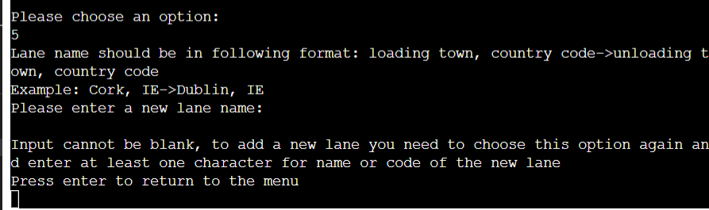

When the user enter a name for the new lane then the program will print status updates on the progress: "Adding headings..." and "Updating worksheets"
The data under the heading of the new lane in all worksheets will be updated as 0 for previous operations and next day planning.
The program will then print a confirmation that the new lane has been added successfully.
The program closes to correctly access the updated data.

The user needs to re-open the application after the update to continue using the program.

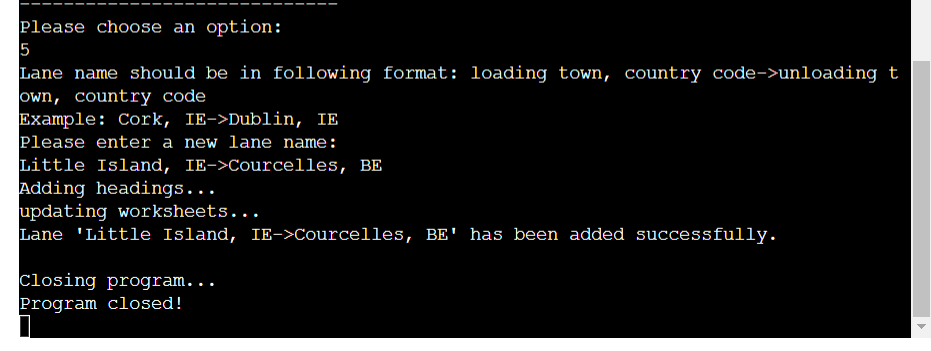

#### Option 6: Delete a lane & exit
When the user chooses this option firstly is able to preview lane names in the program, the program communicates to select a lane to be deleted.
The user can select the lane to be deleted by its index: the first lane from the left has index 1 and user needs to count the number to identfy the lane to be deleted.
The program also prints the range of indexes to choose from. The user is asked to enter index for example: 1, which must be confirmed by pressing enter key.

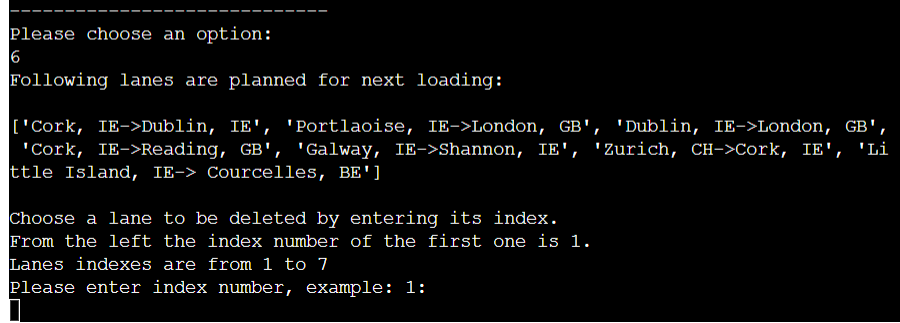

When the user inputs index that does not exist, the program will inform that it was invalid  and reminds the user the range of indexes.

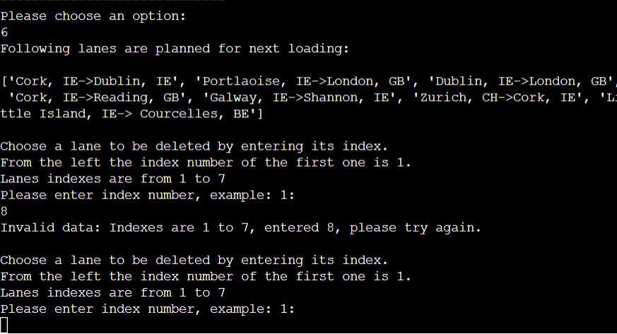

In case the user input is a letter or blank, the program will inform that it needs to be a number with base 10:

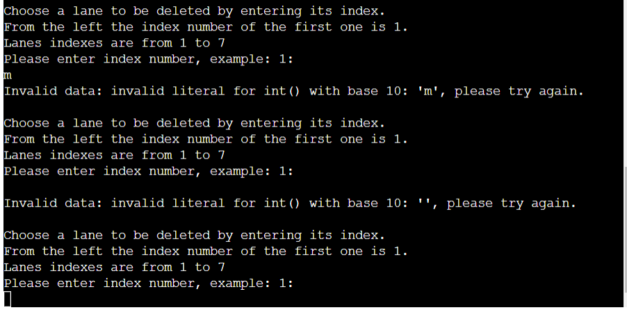

Once the correct index is entered, the program asks the user to confirm deleting lane of the chosen index. 
Entering no or n and pressing enter prints message that deleting lane has been stopped and displays the main menu.
If users confirms by typing yes or y confirmed by enter key then the program deletes the lane number 7 and informs the user.
The program closes to correctly access the updated data.

The user needs to re-open the application after the update to continue using the program.

At least one lane must be in the program so the user is prevented to delete the last one.
The user needs to enter one more lane using the option 5 to be able to delete the lane that remained as last one,
If no other lane is known, lane name such: "???" can be used temporarily while adding an extra one.

#### Option 7: Clear RECENT non-default data & exit.

There is a minimum set of default numeric data: 6 rows for loaded and added_unused worksheets, and 7 rows for planned worksheet to provide some base data for calculations. 

The user can delete the most recent non-default data from all worksheets by choosing option 7. 
Once the option is chosen, the user is asked to confirm deleting LAST.

Typing no or n (in both cases input must be  in small cases) confirmed by enter inform that the action has been stopped and displays the main menu.

Input of yes or y (in both cases input must be  in small cases) and enter deletes the most recent non-default data or informs that no more data can be deleted from the program.

If the user inputs other data than y/yes or n/no the prgoram informs about invalid input and the user needs to return to the main menu by pressing enter.

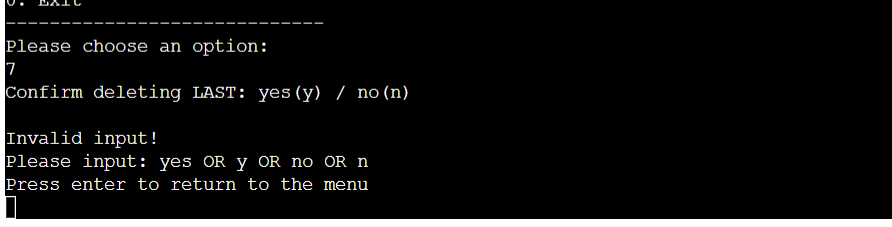

The program closes to correctly access the updated data.
The user needs to re-open the application after the update to continue using the program.

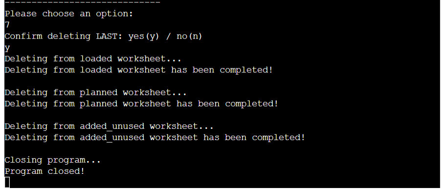
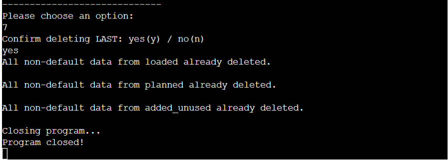

#### Option 8: Clear ALL non-default data & exit

There is a minimum set of default numeric data: 6 rows for loaded and added_unused worksheets, and 7 rows for planned worksheet to provide some base data for calculations.

The user can delete all non-default data from all worksheets by choosing option 8. 
Once the option is chosen, the user is asked to confirm deleting ALL.

Typing no or n confirmed by enter inform that the action has been stopped and displays the main menu.

Input of yes or y and enter deletes all non-default data or informs that no more data can be deleted from the program.

If the user inputs other data than y/yes or n/no the prgoram informs about invalid input and the user needs to return to the main menu by pressing enter.

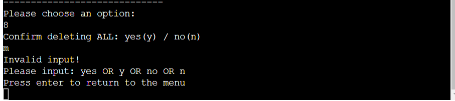

The program closes to correctly access the updated data.
The user needs to re-open the application after the update to continue using the program.

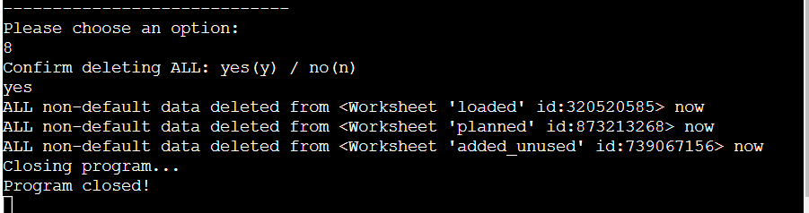
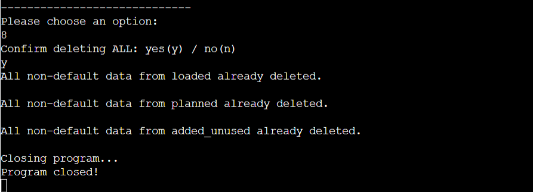

#### Option 9: Run daily trailer forecast & exit

Once the option 9 is selected by the user the program dispalys lane names and information about the required input: 
It must be as many numbers as many lanes in use, separated by commas: example: 1,2,3,4,5,6

The user must enter numbers of how many trailers were loaded during the last operations for the corresponding service in the same order as per the lane names list.
Example below: 2 trailers were loaded for the Cork, IE->Dublin, IE lane

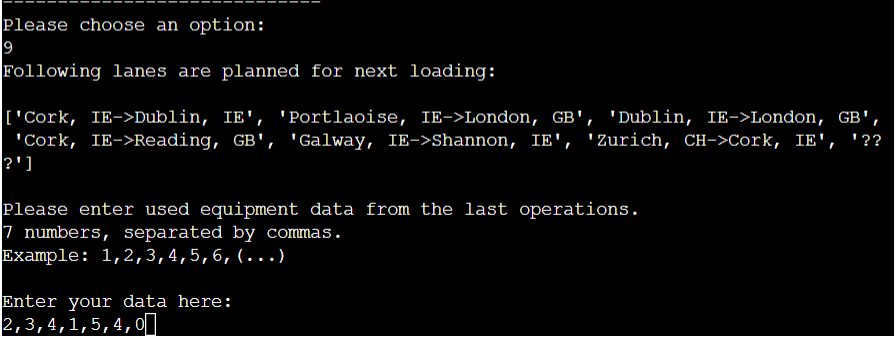

In case there is not enough, too many numbers or not a number was entered the program informs that the data is invalid until valid input is provided.

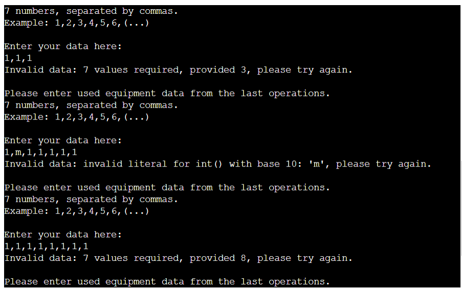

Once the entered data is valid the program proceeds updating on the status of the process.
The program closes to correctly access the updated data.
The user needs to re-open the application after the update to continue using the program.

 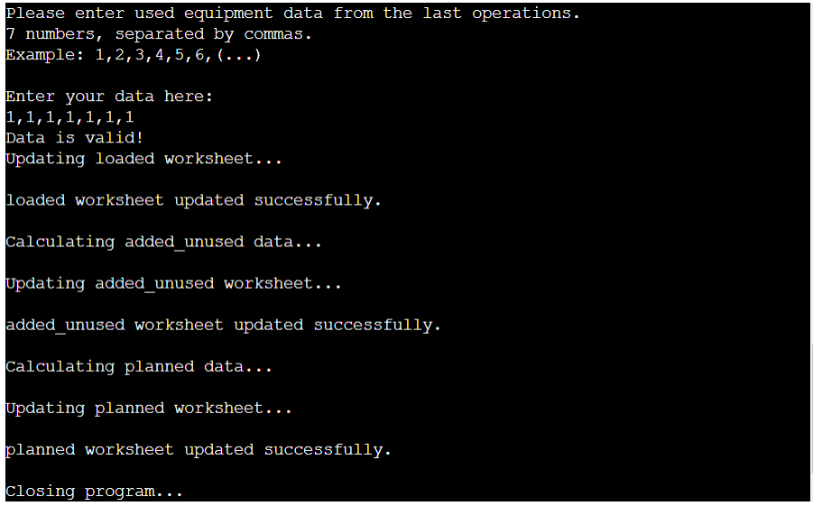

#### Option 0: Exit
This option closes the program.

[Back to Table Of Contents](#table-of-contents)

### User Stories

#### Users

As a user I want to:

1. Be introduced what is the program about.
2. Know what are the options of the program.
3. Check details about trailers loaded during the last operations.
4. See how many trailers were recently planned for loading.
5. Identify how many trailers were unloaded or ordered at the day.
6. Review costs associated with the incorrect demand planning.
7. Add a new lane to the program.
8. Delete one of the lanes from the program.
9. Clear most recent data from the program.
10. Reset the data from the program to contain only necessary default values.
11. Automate my daily tedious tasks.
12. Easily exit the program when processes are completed.

#### Site Owner

As the site owner I want to:

13. Enable users to easily learn about the options of the program and how to use it.
14. Prevent users from entering incorrect inputs and guide them what is required.
15. Ensure users operate with the most up to date data.
16. Verify the accuracy of the automated forecasting and see how it impacts operational costs.

[Back to Table Of Contents](#table-of-contents)

## Technical Design

Flowchart

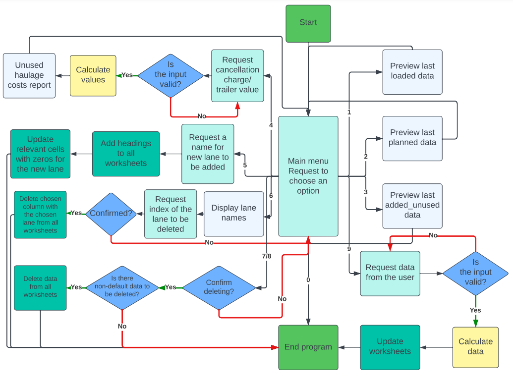

[Back to Table Of Contents](#table-of-contents)

## Languages
- Python

[Back to Table Of Contents](#table-of-contents)

## Technologies Used
- [GitHub](https://github.com/)
- [Gitpod](https://gitpod.io/)
- [Heroku](https://id.heroku.com/)
- [Lucidchart](https://lucid.app/)
- [Google Sheets](https://docs.google.com/spreadsheets)
- [Google Cloud](https://console.cloud.google.com/)
- [CI Python Linter](https://pep8ci.herokuapp.com/)
- [YouTube](https://www.youtube.com/) to find video tutorial how to create a program menu in Python.

[Back to Table Of Contents](#table-of-contents)

## Libraries
- [gspread](https://docs.gspread.org/en/latest/index.html) : to add and manipulate data in Google Sheet and to enable interactions with Google APIs
- [google.oauth2.service_account](https://google-auth.readthedocs.io/en/master/) : used to set up the authentification needed to access the Google API and connect my Service Account using the Credentials. A creds.json file is created with required details that the API needs to access the google account.

[Back to Table Of Contents](#table-of-contents)

## Features

    
Logo
  
    Printed above the menu options  
    The logo consists of a trailer with the program name inside: TRAILERS DEMAND PLANNER. 
    It gives the user a brief graphical introduction what is the program about.  
    User stories covered: 1.
    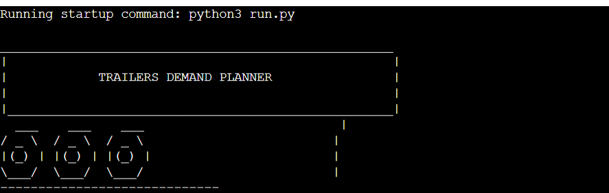    

 

    
Main menu
  
    Prints menu options  
    Displays all options of the program from: 1 - 0 . 
    Informs the user what can be done in the program and displays the number to be entered to select the option.  
    User stories covered: 2, 13.
        

 

    
Option 1: Preview last loaded data
  
    Prints lane headings with the number of trailers loaded last time  
    Provides the user with historical data that may be useful in performing work tasks such as supporting non-automated decision making processes.  
    User stories covered: 3, 15.
    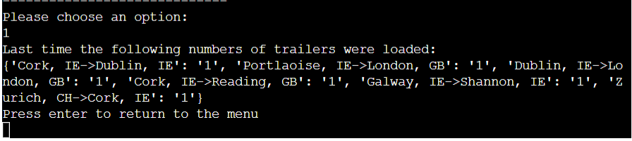    

 

    
Option 2: Preview last planned data
  
    Prints lane headings with the number of trailers that were planned lately  
    User can review how many trailers are to be loaded if the daily forecast process has been completed,
    Or preview it before running the daily forecast for data analysis.
    User stories covered: 4.
    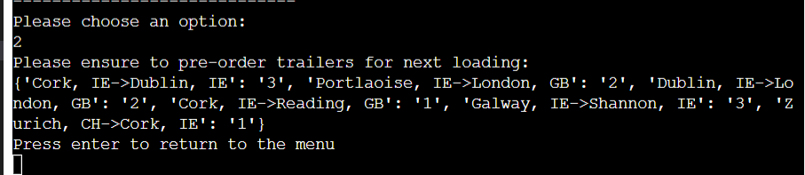    

 

    
Option 3: Preview last added_unused data
  
    Prints lane headings with the number of trailers that were unused(postiive numbers), when the planning was 100% accurate before loading(zeros) & trailers ordered for the operations on last minute(negative numbers). 
    User can review how many trailers were left unitilised during the last operations. 
    The feature provides a source of information to assist the users when working with the program to enable the current transport market trends review at that due to many reasons may not correspond to the programmed planning calculations.   
    User stories covered: 5, 15.
    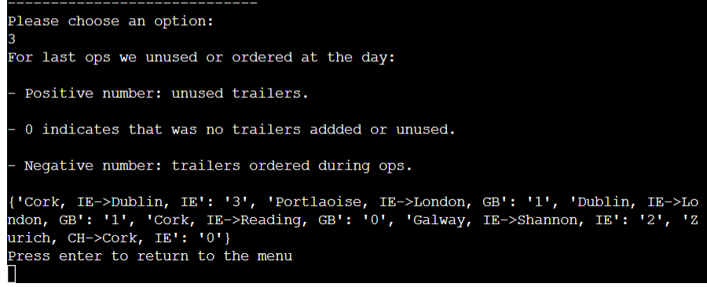    

 

    
Option 4: Run unused haulage costs report
 
    Requests from the user to enter how much the cancellation charge per trailer is. 
    If the user does not know/ is not sure how much it would be(e.g. a new starter in the industry),
    then the program assumes the standard charge in the business: €250/trailer. 
    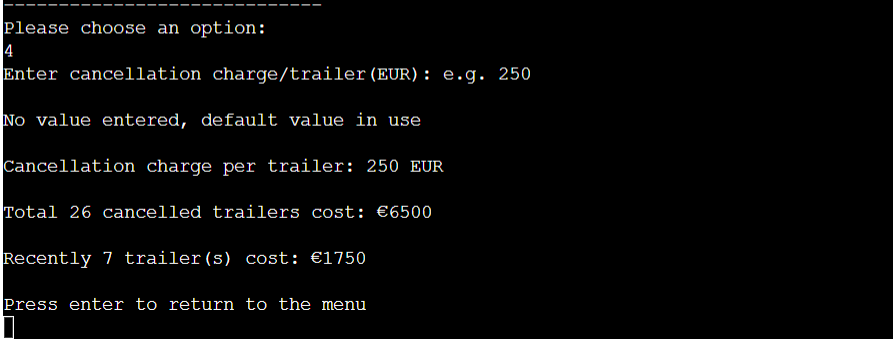
    The user is prevented to enter invalid data such letters:
    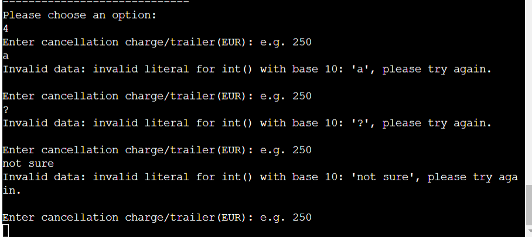
    User can review costs of unused trailer in total from all date in the program or recent costs. 
    This feature enables the user to review data focused to assist with on one of the main tasks of a freight forwarder: cost minimization and reduction of resources waste.  
    User stories covered: 6, 14, 16.
        

 

    
Option 5: Add a new lane & exit
 
    Requests from the user to enter a lane name to be added to the program. 
    The user can add any name as required as some of the names can be an alphanumeric code, however  the input cannot be blank:. 
    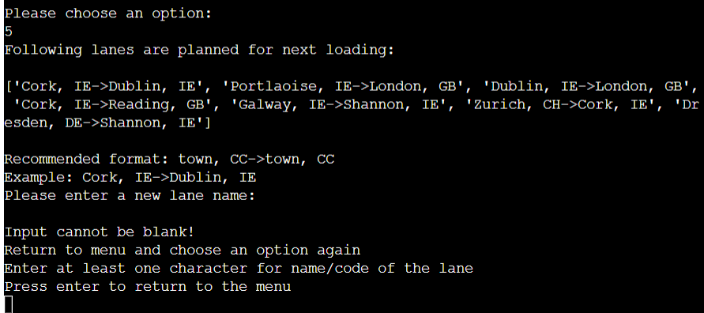  
    The feature provides users with an option to extend the use of the program in time when the business develops and a new service is added for freight operations. 
    User stories covered: 7, 14, 15.  

 

    
Option 6: Delete a lane & exit
 
    Displays lanes currently planned for loading and requests index of the lane to be deleted. 
    The user is prevented to request deleting lane index that does not exist or enters a letter instead. 
      
      
    The feature provides users with an option that enables the use of the program after adjusting to the business dynamics when a service is ceased. 
    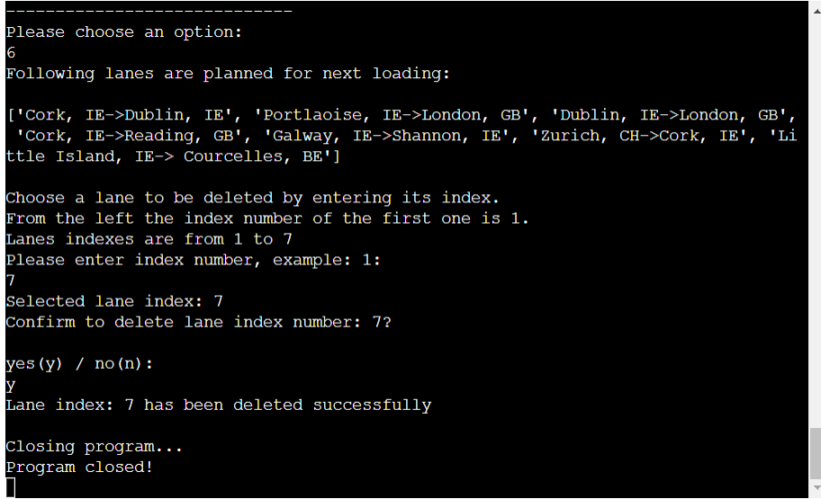 
    User stories covered: 8, 14, 15.

    
Option 7: Clear RECENT non-default data & exit

    This program's feature deletes last rows of numeric data from all worksheets that is considered non-default(6 rows for loaded & added_unused worsheets, and 7 rows for planned worksheet). 
    The user is asked to confirm the intention of deleting the last rows of data in case the option was selected in error. 
    If the confirmation input is different than yes/y/no/n then the user is informed and must return to the main menu. 
     
    If all non-default data has already been deleted the program informs the user. 
    
    Option 7, allows the user to remove the numeric data from the program, for example when the user incorrectly entered values for the daily trailer forecast. 
     
    User stories covered: 9, 14, 15.
</details

