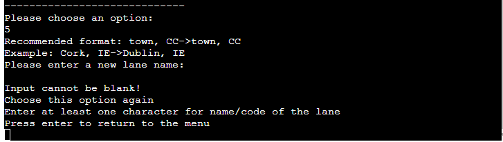
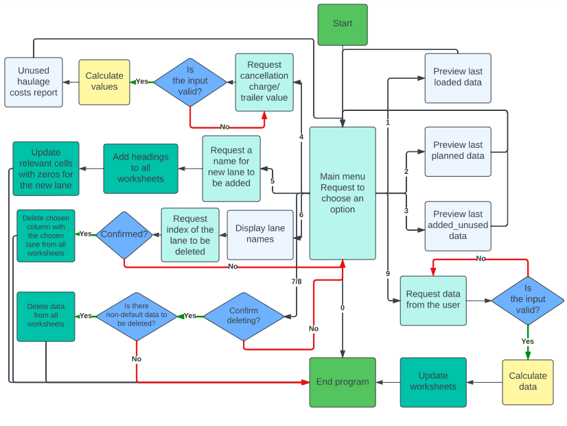
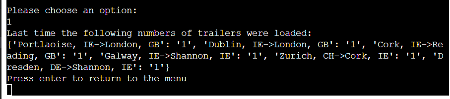

# Trailers Demand Planner
(Developer: Kamil Wojciechowski)

[Live webpage](https://trailers-demand-planner.herokuapp.com/)

## About 

Trailers Demand Planner - program inspired by work experience of a freight forwarder.

Calculates a forecast how many trailers are to be ordered from a haulier by a freight forwarder based on previous data.
Additionally other options allow the user to preview the data, run unused haulage costs report with possibility of adding/deleting lanes. 

Its objective is to support everyday tasks of a freight forwarder.

## Table of Contents

1. [Project Goals](#project-goals)
    - [User Goals](#user-goals)
    - [Business Owner Goals](#business-owner-goals)
2. [User Experience](#user-experience)
    - [Target Audience](#target-audience)
    - [User Requirements and Expectations](#user-requirements-and-expectations)
    - [User Manual](#user-manual)
    - [User Stories](#user-stories)
3. [Technical Design](#technical-design)
4. [Languages](#languages)
5. [Technologies Used](#technologies-used)
6. [Libraries](#libraries)
7. [Features](#features)
8. [Validation](#validation)
10. [Manual User Stories Testing](#manual-user-stories-testing)
11. [Bugs](#bugs)
12. [Deployment](#deployment)
13. [Credits](#credits)
14. [Acknowledgements](#acknowledgements)

## Project Goals

### User Goals
- Find how many trailers were loaded last time.
- Check how many trailers should be ordered for next loading operations.
- Check how many trailers were left unused or ordered without advance.
- Identify costs generated by unused trailers.
- Add or delete lane.
- Delete previously entered data.
- Automate daily tasks of forecasting trailers demand.

### Business Owner Goals
- Access data related to daily operations.
- Identify unecessary operations costs.
- Provide employees with a simple tool to manage their daily tasks. 
- Improve productivity by automatic day-to-day tasks.

[Back to Table Of Contents](#table-of-contents)

## User Experience

### Target Audience
- Freight forwarders, planners, road logistics operators or other similar specialists working in the transport, supply chain & logistics field. 
- Companies involved in the relevant operations specific to the transport, supply chain & logistics field.

### User Requirements and Expectations
- A simple, easy to train on tool to manage daily tasks at work.
- Easy access to information crucial to perform the operations.
- Easy navigation.
- Possiblity to confirm intention to delete.

### User Manual

Click for instructions

#### Main Menu
Opens with the program Consists of three main parts:
- Logo
- Options
- User input

Actions:
- Review and select one of the options by inputing the index number of the option confirming with enter.
- If an invalid option is selected the program will print: "Invalid Option, please try again" & "Press enter to return to the menu": 
    In this case user needs to press enter to see the main menu again and choose one of the options: 1 - 9 or 0

#### Option 1: Preview last loaded data
After choosing option 1 the program will print how many trailers were loaded for their corresponding lane,
Example 'Cork, IE->Dublin, IE': '0', which should be interpreted as 0 trailers were loaded during last operations on the Cork, IE->Dublin, IE lane.

Below the program prints "Press enter to return to the menu": to print the main menu press enter.

#### Option 2: Preview last planned data
Selecting Option 2 prints a reminder to pre-order trailers for next operations.
Example 'Cork, IE->Dublin, IE': '2', which means the user should contact a haulage opeartor to order 2 trailers.

The option can be used to check what was planned for the operations before running the daily trailer forecast (option 9) or
After the daily trailer forecast as a support when ordering trailers from haulage providers for next loading.

Below the program prints "Press enter to return to the menu": to print the main menu press enter.

#### Option 3: Preview last added_unused data
Option 3 displays how many trailers were unused (positive numbers) or ordered at the day (negative numbers) during last opeartions for each lane.
Example 1: 'Cork, IE->Dublin, IE': '2', means that 2 trailers were planned previosuly without the need and eventually were not loaded.
Example 2: 'Cork, IE->Reading, GB': '-1', there was one trailer loaded more than planned and the freight forwarder had to contact a haulage opeartor to order 1 trailer for loading on the day of operations.

Below the program prints "Press enter to return to the menu": to print the main menu press enter.

#### Option 4: Run unused haulage costs report
Choosing this option the user will be asked to confirm how much haulier operator will charge the freight forwarding company for cancelling loading at the day operations.
If the input is invalid the program will display an error: Invalid data, in case there the input is blank the program will assume €250 as default cancellation charge.

The program prints information how many trailers in total were unused and how much it cost and below same for most recent opearations only. 

Below the program prints "Press enter to return to the menu": to print the main menu press enter.

#### Option 5: Add a new lane & exit 
After selection of the option 5 the user will be requested to specify a name for the new lane to be added suggesting to follow same format: Cork, IE->Dublin, IE'
However, as some lane names may need to be a code/ serial number or other non-standard name that would allow the user to choose it according to the operational needs,
the user can enter any name of their choice besides empty or exact duplicate input which will be communicated to the user and will need to choose this option again to proceed.

When the user enter a name for the new lane then the program will print status updates on the progress: "Adding headings..." and "Updating worksheets"
The data under the heading of the new lane in all worksheets will be updated as 0 for previous operations and next day planning.
The program will then print a confirmation that the new lane has been added successfully.
The program closes to correctly access the updated data.

The user needs to re-open the application after the update to continue using the program.

#### Option 6: Delete a lane & exit
When the user chooses this option firstly is able to preview lane names in the program, the program communicates to select a lane to be deleted.
The user can select the lane to be deleted by its index: the first lane from the left has index 1 and user needs to count the number to identfy the lane to be deleted.
The program also prints the range of indexes to choose from. The user is asked to enter index for example: 1, which must be confirmed by pressing enter key.

When the user inputs index that does not exist, the program will inform that it was invalid  and reminds the user the range of indexes.

In case the user input is a letter or blank, the program will inform that it needs to be a number with base 10:

Once the correct index is entered, the program asks the user to confirm deleting lane of the chosen index. 
Entering no or n and pressing enter prints message that deleting lane has been stopped and displays the main menu.
If users confirms by typing yes or y confirmed by enter key then the program deletes the lane number 7 and informs the user.
The program closes to correctly access the updated data.

The user needs to re-open the application after the update to continue using the program.

At least one lane must be in the program so the user is prevented to delete the last one.
The user needs to enter one more lane using the option 5 to be able to delete the lane that remained as last one,
If no other lane is known, lane name such: "???" can be used temporarily while adding an extra one.

#### Option 7: Clear RECENT non-default data & exit.

There is a minimum set of default numeric data: 6 rows for loaded and added_unused worksheets, and 7 rows for planned worksheet to provide some base data for calculations. 

The user can delete the most recent non-default data from all worksheets by choosing option 7. 
Once the option is chosen, the user is asked to confirm deleting LAST.

Typing no or n (in both cases input must be  in small cases) confirmed by enter inform that the action has been stopped and displays the main menu.

Input of yes or y (in both cases input must be  in small cases) and enter deletes the most recent non-default data or informs that no more data can be deleted from the program.

If the user inputs other data than y/yes or n/no the prgoram informs about invalid input and the user needs to return to the main menu by pressing enter.

The program closes to correctly access the updated data.
The user needs to re-open the application after the update to continue using the program.

#### Option 8: Clear ALL non-default data & exit

There is a minimum set of default numeric data: 6 rows for loaded and added_unused worksheets, and 7 rows for planned worksheet to provide some base data for calculations.

The user can delete all non-default data from all worksheets by choosing option 8. 
Once the option is chosen, the user is asked to confirm deleting ALL.

Typing no or n confirmed by enter inform that the action has been stopped and displays the main menu.

Input of yes or y and enter deletes all non-default data or informs that no more data can be deleted from the program.

If the user inputs other data than y/yes or n/no the prgoram informs about invalid input and the user needs to return to the main menu by pressing enter.

The program closes to correctly access the updated data.
The user needs to re-open the application after the update to continue using the program.

#### Option 9: Run daily trailer forecast & exit

Once the option 9 is selected by the user the program dispalys lane names and information about the required input: 
It must be as many numbers as many lanes in use, separated by commas: example: 1,2,3,4,5,6

The user must enter numbers of how many trailers were loaded during the last operations for the corresponding service in the same order as per the lane names list.
Example below: 2 trailers were loaded for the Cork, IE->Dublin, IE lane

In case there is not enough, too many numbers or not a number was entered the program informs that the data is invalid until valid input is provided.

Once the entered data is valid the program proceeds updating on the status of the process.
The program closes to correctly access the updated data.
The user needs to re-open the application after the update to continue using the program.

 

#### Option 0: Exit
This option closes the program.

[Back to Table Of Contents](#table-of-contents)

### User Stories

#### Users

As a user I want to:

1. Be introduced what is the program about.
2. Know what are the options of the program.
3. Check details about trailers loaded during the last operations.
4. See how many trailers were recently planned for loading.
5. Identify how many trailers were unloaded or ordered at the day.
6. Review costs associated with the incorrect demand planning.
7. Add a new lane to the program.
8. Delete one of the lanes from the program.
9. Clear most recent data from the program.
10. Reset the data from the program to contain only necessary default values.
11. Automate my daily tedious tasks.

#### Site Owner

As the site owner I want to:

12. Enable users to easily learn about the options of the program and how to use it.
13. Prevent users from entering incorrect inputs and guide them what is required.
14. Ensure users operate with the most up to date data.
15. Verify the accuracy of the automated forecasting and see how it impacts operational costs.

[Back to Table Of Contents](#table-of-contents)

## Technical Design

Flowchart

[Back to Table Of Contents](#table-of-contents)

## Languages
- Python

[Back to Table Of Contents](#table-of-contents)

## Technologies Used
- [GitHub](https://github.com/)
- [Gitpod](https://gitpod.io/)
- [Heroku](https://id.heroku.com/)
- [Lucidchart](https://lucid.app/)
- [Google Sheets](https://docs.google.com/spreadsheets)
- [Google Cloud](https://console.cloud.google.com/)
- [CI Python Linter](https://pep8ci.herokuapp.com/)
- [YouTube](https://www.youtube.com/) to find video tutorial how to create a program menu in Python.

[Back to Table Of Contents](#table-of-contents)

## Libraries

### Third Party Libraries
- [gspread](https://docs.gspread.org/en/latest/index.html) : to add and manipulate data in Google Sheet and to enable interactions with Google APIs
- [google.oauth2.service_account](https://google-auth.readthedocs.io/en/master/) : used to set up the authentification needed to access the Google API and connect my Service Account using the Credentials. A creds.json file is created with required details that the API needs to access the google account.

[Back to Table Of Contents](#table-of-contents)

## Features

    
Logo
  
    Printed above the menu options  
    The logo consists of a trailer with the program name inside: TRAILERS DEMAND PLANNER. 
    It gives the user a brief graphical introduction what is the program about.  
    User stories covered: 1.
        

 

    
Main menu
  
    Prints menu options  
    Displays all options of the program from: 0 - 9. 
    Informs the user what can be done in the program and displays the number to be entered to select the option.  
    User stories covered: 2, 12, 13.
        

 

    
Option 1: Preview last loaded data
  
    Prints lane headings with the number of trailers loaded last time  
    Provides the user with historical data that may be useful in performing work tasks such as supporting non-automated decision making processes.  
    User stories covered: 3, 14.
        

 

    
Option 2: Preview last planned data
  
    Prints lane headings with the number of trailers that were planned lately.  
    User can review how many trailers are to be loaded if the daily forecast process has been completed,
    Or preview it before running the daily forecast for data analysis. 
    User stories covered: 4.
        

 

    
Option 3: Preview last added_unused data
  
    Prints lane headings with the number of trailers that were unused(postiive numbers), when the planning was 100% accurate before loading(zeros) & trailers ordered for the operations on last minute(negative numbers). 
    User can review how many trailers were left unitilised during the last operations. 
    The feature provides a source of information to assist the users when working with the program to enable the current transport market trends review at that due to many reasons may not correspond to the programmed planning calculations.   
    User stories covered: 5, 14.
        

 

    
Option 4: Run unused haulage costs report
 
    Requests from the user to enter how much the cancellation charge per trailer is. 
    If the user does not know/ is not sure how much it would be(e.g. a new starter in the industry),
    then the program assumes the standard charge in the business: €250/trailer. 
    
    The user is prevented to enter invalid data such letters:
    
    User can review costs of unused trailer in total from all date in the program or recent costs. 
    This feature enables the user to review data focused to assist with on one of the main tasks of a freight forwarder: cost minimization and reduction of resources waste.  
    User stories covered: 6, 13, 15.
        

 

    
Option 5: Add a new lane & exit
 
    Requests from the user to enter a lane name to be added to the program. 
    The user can add any name as required as some of the names can be an alphanumeric code, however the input cannot be blank or exactly same as one of the existing lanes:. 
    
     
    The feature provides users with an option to extend the use of the program in time when the business develops and a new service is added for freight operations. 
    User stories covered: 7, 13, 14.
       

 

    
Option 6: Delete a lane & exit
 
    Displays lanes currently planned for loading and requests index of the lane to be deleted. 
    The user is prevented to request deleting lane index that does not exist or enters a letter instead. 
      
      
    The feature provides users with an option that enables the use of the program after adjusting to the business dynamics when a service is ceased. 
     
    User stories covered: 8, 13, 14.

    
Option 7: Clear RECENT non-default data & exit

    This program's feature deletes last rows of numeric data from all worksheets that is considered non-default(6 rows for loaded & added_unused worsheets, and 7 rows for planned worksheet). 
    The user is asked to confirm the intention of deleting the last rows of data in case the option was selected in error. 
    If the confirmation input is different than yes/y/no/n then the user is informed and must return to the main menu. 
     
    If all non-default data has already been deleted the program informs the user. 
    
    Option 7, allows the user to remove the most recent numeric data from the program, for example when the user incorrectly entered values for the daily trailer forecast. 
     
    User stories covered: 9, 14.

    
Option 8: Clear ALL non-default data & exit

    This program's feature deletes ALL rows of numeric data from all worksheets that is considered non-default(6 rows for loaded & added_unused worsheets, and 7 rows for planned worksheet). 
    The user is asked to confirm the intention of deleting the all rows of data in case the option was selected in error. 
    If the confirmation input is different than yes/y/no/n then the user is informed and must return to the main menu. 
     
    If all non-default data has already been deleted the program informs the user. 
    
    Option 8, allows the user to remove all numeric data from the program, for example to reset the data at the begging of a new operational period such week, month, year quarter or year. 
     
    User stories covered: 10, 14.

    
Option 9: Run daily trailer forecast & exit

    The feature automates one of the most repetitive tasks of freight forwarders which may be especially useful for people unexperience in the industry and can find planning orders for next days challenging. 
    List of lanes in use is displayed to assist with entering values for the requested input. 
    
    The user is requested to enter how many trailers were used for each lane (as many numbers required as many lanes are in the program). 
    If the user provides incorrect input, the program informs about it. 
    
    Using this feature allows the user to reduce the time spent for regular, repetitive, daily tasks. Additionally it may decrease the risk of a human error as it is present during manual calculations, for example, due to a distraction during manual calulations (the operator can receive a call or answer a manager's/colleague's question in the office). 
    User stories covered: 11, 13, 14.
     

[Back to Table Of Contents](#table-of-contents)

## Validation 

[CI Python Linter](https://pep8ci.herokuapp.com/) was used to perfrom the check if the code meets PEP8 requirements. All clear, no errors found:

[Back to Table Of Contents](#table-of-contents)

## Manual User Stories Testing

Click to see user stories testing

---------------------------------------------------------------

1. As a user I want to be introduced what is the program about.

| Feature | Action  | Expected Result | Actual Result |
| ------- | ------- | --------------- | ------------- |
| Logo | Open the application | Users are presented with a trailer-shaped logo with the application name inside | Works as expected |

2. As a user I want to know what are the options of the program.

| Feature | Action  | Expected Result | Actual Result |
| ------- | ------- | --------------- | ------------- |
| Main menu |  Open the application | Users are presented with program's options | Works as expected |

3. As a user I want to check details about trailers loaded during the last operations.

| Feature | Action  | Expected Result | Actual Result |
| ------- | ------- | --------------- | ------------- |
| Option 1: Preview last loaded data | From the main menu type 1 and confirm by pressing enter key | Users see a table of lane names with the corresponing number of loaded trailers lately (column headings with the data from the lowest cell of loaded worksheet) | Works as expected |

4. As a user I want to see how many trailers were recently planned for loading.

| Feature | Action  | Expected Result | Actual Result |
| ------- | ------- | --------------- | ------------- |
| Option 2: Preview last planned data | In the main menu type 2 and confirm by pressing enter key | Users see a table of lane names with the corresponing number of planned trailers (column headings with the data from the lowest cell of planned worksheet) | Works as expected |

5. As a user I want to identify how many trailers were unloaded or ordered at the day.

| Feature | Action  | Expected Result | Actual Result |
| ------- | ------- | --------------- | ------------- |
| Option 3: Preview last added_unused data | In the main menu type 3 and confirm by pressing enter key | Users see a table of lane names with the corresponing numbers: postive represent trailers unused, negative ordered at the day or zeros inform there was nothing left unloaded or had to be ordered extra to complete the operations (column headings with the data from the lowest cell of added_unused worksheet) | Works as expected |

6. As a user I want to review costs associated with the incorrect demand planning.

| Feature | Action  | Expected Result | Actual Result |
| ------- | ------- | --------------- | ------------- |
| Option 4: Run unused haulage costs report | In the main menu type 4 and confirm by pressing enter key, then input an integer for cancellation charge and press enter or leave it blank and press enter for the default value to be applied | The program displays how many trailers were cancelled and how much it cost in total & recently | Works as expected |

7. As a user I want to add a new lane to the program.

| Feature | Action  | Expected Result | Actual Result |
| ------- | ------- | --------------- | ------------- |
| Option 5: Add a new lane & exit | In the main menu type 5 and confirm by pressing enter key, enter a name in any format or as recommended and press enter | The program displays the list of lane names, recommends the format of the input gives an example, once a new name(is not blank or exact same as one of the lanes) is entered then updates on the progress are printed, lane is added to all worksheets and program closes | Works as expected |

8. As a user I want to delete one of the lanes from the program.

| Feature | Action  | Expected Result | Actual Result |
| ------- | ------- | --------------- | ------------- |
| Option 6: Delete a lane & exit | In the main menu type 6 and confirm by pressing enter key, review the list of lanes and identify the index of the lane to be deleted(index of first lane from the left is 1), type identified index and press enter, confirm inention of deleting the selected lane by typing 'yes' or 'y' and press enter | The program displays list of lanes, and informs the range of indexes to choose from, asks to confirm the choice, deletes the lane from all worksheets, and closes the program  | Works as expected |

9. As a user I want to clear most recent data from the program.

| Feature | Action  | Expected Result | Actual Result |
| ------- | ------- | --------------- | ------------- |
| Option 7: Clear RECENT non-default data & exit | In the main menu type 7 and confirm by pressing enter key, confirm deleting LAST by typing 'yes' or y' then press enter | The program asks to confirm the intention, deletes non-default data from last rows of all worksheets or informs that all non-default data has already been deleted and closes the program | Works as expected |

10. As a user I want to reset the data from the program to contain only necessary default values.

| Feature | Action  | Expected Result | Actual Result |
| ------- | ------- | --------------- | ------------- |
| Option 8: Clear ALL non-default data & exit | In the main menu type 8 and confirm by pressing enter key, confirm deleting ALL by typing 'yes' or y' then press enter | The program asks to confirm the intention, deletes all non-default data from all worksheets or informs it has already been deleted and closes the program | Works as expected |

11. As a user I want to automate my daily tedious tasks.

| Feature | Action  | Expected Result | Actual Result |
| ------- | ------- | --------------- | ------------- |
| Option 9: Run daily trailer forecast & exit | In the main menu type 9 and confirm by pressing enter key, enter data representing how many trailers were used for the last oparations: as many numbers as many lanes planned, separated by commas and press enter  | Users are presented with the list of planned lanes with printed instructions to correctly enter data, the program runs daily trailer forecast and closes program  | Works as expected |

12. As the site owner I want to enable users to easily learn about the options of the program and how to use it.

| Feature | Action  | Expected Result | Actual Result |
| ------- | ------- | --------------- | ------------- |
| Main menu | Open the application | The user is presented with range of options with their indexed (1 - 9 & 0) with their descriptions pointing their use | Works as expected |

13. As the site owner I want to prevent users from entering incorrect inputs and guide them what is required.

| Feature | Action  | Expected Result | Actual Result |
| ------- | ------- | --------------- | ------------- |
| Option 4: Run unused haulage costs report | In the main menu type 4 and confirm by pressing enter key, then input something different than an integer ( for example a letter) for cancellation charge and press enter | Program informs that that data is invalid and repeats request to enter cancellation charge until input is correct | Works as expected |
| Option 5: Add a new lane & exit | In the main menu type 5 and confirm by pressing enter key, enter exact same name as one of the existing lanes or leave input blank and press enter | Users are informed that input cannot be blank or the entered name is already added, and that they should to return to menu by pressing enter where they can choose one of the options again | Works as expected |
| Option 6: Delete a lane & exit | In the main menu type 6 and confirm by pressing enter key, type index outside of the presented range and press enter | Users are informed that the range of indexes is from x to y, however, z was entered, program repeats the request for a valid input | Works as expected |
| Option 9: Run daily trailer forecast & exit | In the main menu type 9 and confirm by pressing enter key, enter some data that is against the presented instructions (letters, special signs, floats, not as many numbers as instructed) and press enter | Informs that data is invalid or that x numbers is required, but only y is provided | Works as expected |
| Main menu | Open the application and type a number or letter different than 0 - 9, press enter | User is informed that the selected option is invalid, and to press enter to return to the menu | Works as expected |

14. As the site owner I want to ensure users operate with the most up to date data.

| Feature | Action  | Expected Result | Actual Result |
| ------- | ------- | --------------- | ------------- |
| Option 1: Preview last loaded data | From the main menu type 1 and confirm by pressing enter key | Users see a table of lane names with the corresponing number of loaded trailers lately (column headings with the data from the lowest cell of loaded worksheet) | Users access the most up to date data from loaded worksheet | Works as expected |
| Option 3: Preview last added_unused data | In the main menu type 3 and confirm by pressing enter key | Users see a table of lane names with the corresponing numbers: postive represent trailers unused, negative ordered at the day or zeros inform there was nothing left unloaded or had to be ordered extra to complete the operations (column headings with the data from the lowest cell of added_unused worksheet) |  Users access the most up to date data from added_unused worksheet | Works as expected |
| Option 5: Add a new lane & exit | In the main menu type 5 and confirm by pressing enter key, enter a name in any format or as recommended and press enter, once process is completed reopen the application and open any of the options that display lanes list (e.g. Option 1: Preview last loaded data) | The program displays the list of lane names, recommends the format of the input gives an example, once a new name(is not blank or exact same as one of the lanes) is entered then updates on the progress are printed, lane is added to all worksheets and program closes. After the automatic closing the users reopen the application and can see that new lane is added to the program | Works as expected |
| Option 9: Run daily trailer forecast & exit | In the main menu type 9 and confirm by pressing enter key, enter data representing how many trailers were used for the last oparations: as many numbers as many lanes planned, separated by commas and press enter. Once process is completed reopen the application and open Option 2: Preview last planned data | Users are presented with the list of planned lanes with printed instructions to correctly enter data, the program runs daily trailer forecast and closes program. After the automatic closing the users reopen the application select Option 2: Preview last planned data and see results of the automated forecast for next operations | Works as expected |

15. As the site owner I want to verify the accuracy of the automated forecasting and see how it impacts operational costs.

| Feature | Action  | Expected Result | Actual Result |
| ------- | ------- | --------------- | ------------- |
| Option 4: Run unused haulage costs report | In the main menu type 4 and confirm by pressing enter key, then input an integer for cancellation charge and press enter or leave it blank and press enter for the default value to be applied | The program displays how many trailers were cancelled and how much it cost in total & recently | Works as expected |

[Back to Table Of Contents](#table-of-contents)

## Bugs

| Bug  | Fix  |
| ------- | ------- |
| PEP8 W605 for logo | Add r'before quotation marks in print |
| Daily trailer forecast cannot be run after deleting all data using Option 7 or 8 | Establish minimum default rows to secure calculation process |
| User can add a blank lane name which was poorly displays list of lanes in other functions | Add lane != "" for the if statement for Option 5: Add a new lane & exit |
| if lane not in lanes: statement did not work due to: "TypeError: argument of type 'NoneType' is not iterable" | Update variable lanes from = lane_names() to PLANNED.row_values(1) |

[Back to Table Of Contents](#table-of-contents)

## Deployment
The website was deployed using Heroku following these steps:
1. Use the "pip freeze > requiremnts.txt" command in the terminal then commit and push it to GitHub.
2. Login or create a Heroku account.
3. Click the "new" button in the upper right corner and select "create new app"
4. Choose an app name and your region and click "Create app"
5. Go to the "settings" tab, then to Config Vars and press "Reveal Config Vars".
6. In the field for KEY add "CREDS" and into VALUE field copy & paste entire content of creds.json file, and click "Add".
7. Below add another Config Var with KEY = "PORT" & VALUE = "8000".
8. Add Buildpacks: firtly python (it must be on the top) and then node.js below.
9. Go to the "Deploy" section and select GitHub for Deployment method, click "Connect to GitHub".
10. Search for a repository to connect to.
11. Click enable automatic deploys and then deploy branch.
12. Wait for the app to be built and then click on the "View" link.

You can fork the repository by following these steps:
1. Go to the <a href="https://github.com/WojtekKamilowski/CI_PP3_TDP">GitHub repository</a>.
2. Click on the Fork button in the upper right-hand corner.

You can clone the repository by following these steps:
1. Go to the <a href="https://github.com/WojtekKamilowski/CI_PP3_TDP">GitHub repository</a>.
2. Locate the Code button above the list of files and click it.
3. Select if you prefer to clone using HTTPS, SSH, or Github CLI and click the copy button to copy the URL to your clipboard.
4. Open Git Bash
5. Change the current working directory to the one where you want the cloned directory.
6. Type git clone and paste the URL from the clipboard.
7. Press Enter to create your local clone.

[Back to Table Of Contents](#table-of-contents)

## Credits 
- menu() function and the while loop from main() based on<a href="https://www.youtube.com/watch?v=_qHGNgJ1EcI&t=1s">YouTube</a>.
- daily_trailer_forecast() function with other functions used based on <a href="https://github.com/Code-Institute-Solutions/love-sandwiches-p5-sourcecode/tree/master/05-deployment/01-deployment-part-1">Code Institute</a>.
- int_und_haul_cls variable from added_unused_values() function based on <a href="https://stackoverflow.com/questions/2166577/casting-from-a-list-of-lists-of-strings-to-list-of-lists-of-ints-in-python">STACK OVERFLOW</a>.
- flatten_list(_2d_list) function based on <a href="https://stackabuse.com/python-how-to-flatten-list-of-lists/">Stack Abuse</a>.
- und_haul_vals and lt_und_data variables from unused_haulage_costs() function based on <a href="https://www.codespeedy.com/print-all-positive-numbers-from-a-list-in-python/#:~:text=Using%20the%20%E2%80%9Clambda%E2%80%9D%20function%3A,list%20of%20all%20positive%20numbers.">CodeSpeedy</a>.
- int_last_added_unused_data variable from from unused_haulage_costs() function based on <a href="https://stackoverflow.com/questions/7368789/convert-all-strings-in-a-list-to-int">STACK OVERFLOW</a>.
- logo() function inspired by <a href="https://github.com/aleksandracodes/CI_PP3_Connect4/blob/main/run.py ">CI_PP3_Connect4</a>.
- add_heading(wksh) &  add_values(wksh) function from add_lane(lane) function based on <a href="https://stackoverflow.com/questions/60495748/append-value-to-column-in-gspread">STACK OVERFLOW</a>.
- LOADED.delete_columns(lane_index_int), PLANNED.delete_columns(lane_index_int) & ADDED_UNUSED.delete_columns(lane_index_int) from delete_lane() function based on <a href="https://stackoverflow.com/questions/61213417/delete-remove-column-in-google-sheet-over-gspread-python-like-sheet-delete-row#:~:text=There%20is%20no%20method%20in,this%20with%20a%20batch%20update">STACK OVERFLOW</a>.
- In delete_last_data(wksh, wksh_name) function wksh.delete_rows(last_row) & wksh.delete_rows(dflt_rows + 1, last_row) in delete_all_data(wksh, wksh_name) function based on <a href="https://stackoverflow.com/questions/14625617/how-to-delete-remove-row-from-the-google-spreadsheet-using-gspread-lib-in-pytho#:~:text=Since%20gspread%20version%200.5.,a%20row%20with%20delete_row()%20.&text=Save%20this%20answer.,-Show%20activity%20on">STACK OVERFLOW</a>.
- lane_count(wksh) function based on <a href="https://stackoverflow.com/questions/42378272/col-count-in-gspread-provides-the-total-number-of-columns-even-though-they-have">STACK OVERFLOW</a>.
- second_lane variable from elif option == "6" from <a href="https://docs.gspread.org/en/latest/user-guide.html">gspread</a>.
- Fix of W605 in logo() from <a href="https://www.flake8rules.com/rules/W605.html">Flake8 Rules</a>.

[Back to Table Of Contents](#table-of-contents)

## Acknowledgements
I would like to thank those who were a great support and inspiration during writing this project:
- My mentor Mo Shami.
- My wife who supported me during the process of creating this project.
- Code Institute for preparing the materials and providing a wide range of available means of learning for the students.

